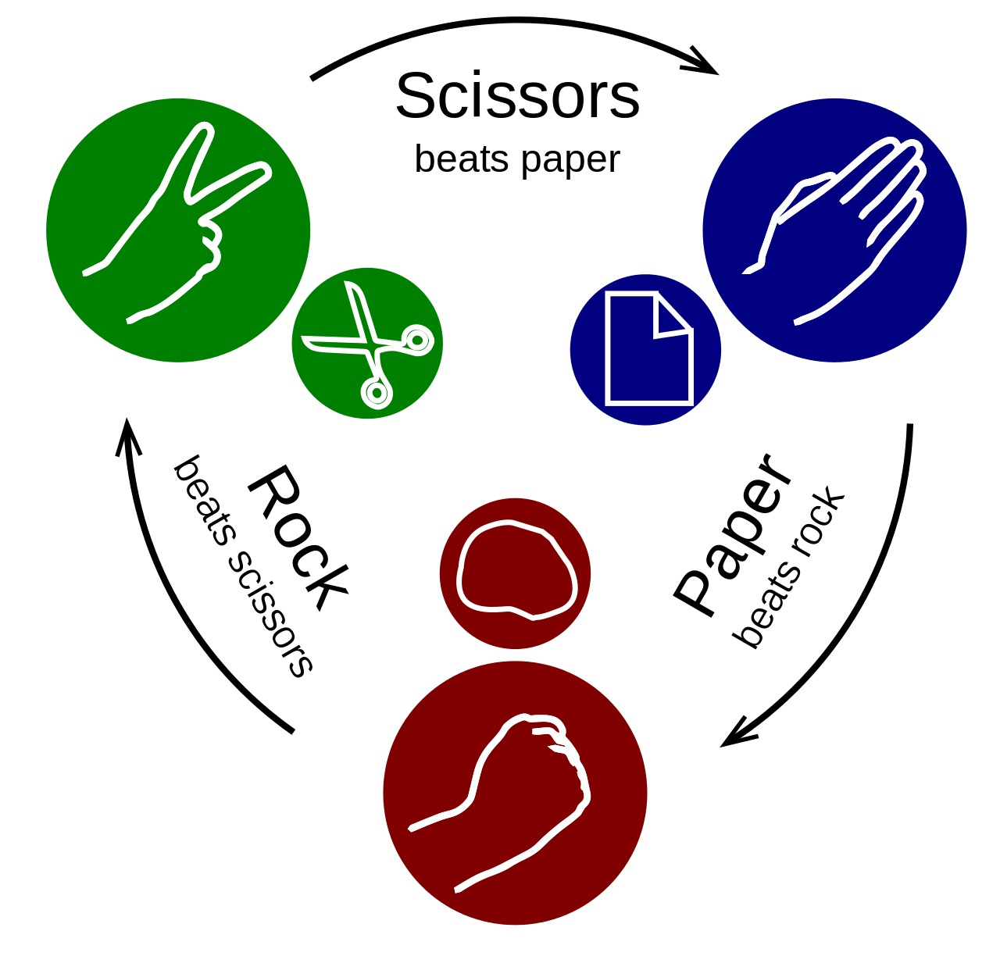

## CS32 PSet \#3

*NOTE: The ["PSet #3" assignment page on the CS 32 Canvas
site](https://canvas.harvard.edu/courses/112459/assignments/654922) indicates
when this assignment is due, what materials you should submit, and how to submit
them.*

**Goal:** Turn GUESS-THE-NUMBER into ROSHAMBO

**What is roshambo?** It is a child's game requiring nothing more than a partner
and two hands. Some people call it "rock paper scissors" because these are the
three objects that the players make with their hands during the game.

You make a "rock" by closing your fist. You make "paper" by leaving your hand
open, as if you were moving to shake someone's hand, and you make "scissors" by
closing all of your fingers except the index and middle ones.



The game proceeds in turns. During a turn, each player secretly chooses a hand
gesture. The two players then simultaneously say, "Rock ... paper ... scissors
... SHOOT!" (Or "Ro ... sham ... BO!") And on the last utterance, the players
together display the hand gesture that they had secretly chosen.

The winner of the round is determined by the precedence among the three
gestures:

- Rock breaks scissors.
- Scissors cuts paper.
- Paper covers rock.

If the two players display the same hand gesture, the turn is a tie.

The game is often used as a way to decide something, as we sometimes do with a
coin flip. "Let's roshambo to decide who gets to pick tonight's movie." The game
can also be played as the best of $N$ rounds.

Unlike a (unbiased) coin flip, you can influence the outcome of this game if you
can recognize and then exploit tendencies in your opponent.

**Big picture.** You're going to build your networked roshambo game in stages.
The first stage will be a non-networked version in which you'll play one round
against the computer. We'll stick with playing one round against the computer as
we begin to create a networked version of the game. Once we have a client-server
version of this simple game, we'll create a 3-round version. In the last step,
we'll get rid of the computer and play against another human, with each player
being on their own computer!

Let's get started!

**Step 1: Non-networked, computer opponent, 1 round.** Write a script called
`roshambo.py`. The structure of this first script should look a lot like
`guess32.py` from class. How is it different?

- The computer randomly chooses from a list of hand shapes, not from a range
  of integers. Which routine in Python's `random` library would should you use?

- When you grab the player’s hand choice, how would you check to see if it is a
  valid choice? HINT: You don’t need to do a type conversion if you select the
  elements of your list of hand shapes thoughtfully. And without a type
  conversion, you won’t need to catch any exceptions!

Your script’s printout should look like these example rounds:

```
$ python3 roshambo.py
## Welcome to ROSHAMBO! ##
Please pick your shape: rock
You: rock   Computer: rock
It's a tie!
$ python3 roshambo.py
## Welcome to ROSHAMBO! ##
Please pick your shape: rock
You: rock   Computer: scissors
You win!
$ python3 roshambo.py
## Welcome to ROSHAMBO! ##
Please pick your shape: thumbs up
Shape must be rock, paper, or scissors. Try again...
Please pick your shape: rock
You: rock   Computer: paper
You lose!
$
```

**Step 2: Networked “smart” server, computer opponent, 1 round.** Split
`roshambo.py` into two networking scripts: a client (`roshambo_dclient.py`); and
a server (`roshambo_sserver.py`). To be clear, you should leave your
`roshambo.py` script alone and create two new scripts, copying content from
`roshambo.py`, `guess-client.py`, and `guess-server.py` as appropriate.

Put the smarts of the game in your new server script, as we did with our
networked `guess` game. The network messages you create should be short
`utf-8`-encoded strings, just like the messages we created in class.

This means that the client does only four pieces of work:

1. create a socket and connect to it;

2. grab the player’s hand choice;

3. send this choice to the server; and

4. print out whatever message it receives back.

The “smart” server does its networking work, and upon receiving the client’s
hand choice, it generates a random choice for the computer, figures out whether
the player or computer won, and sends that information back to the client. The
server prints out nothing but information about its networking work. The
printouts you created in Step 1 should be printed entirely on the client’s
terminal.

Once the server accepts a connection, remember to put your `recv` call inside an
infinite loop, which you `break` out of only when what the `recv` call returns
the empty string. 

> If you think about this, it means that you could start a (correctly
functioning) server once and run multiple rounds against it in a single 
connection, but we won’t do that in this step. Or said another way, don’t worry
about trying to stop the server after it responds to the client’s first message.
It needs to wait for the client to say that it is closing the connection.

Also, in running your scripts, remember to start the server script in one Shell
before you start the client script in another. Or if you want to run both in one
Shell, start the server script in background by appending an ampersand (`&`) to
the end of your command, and then run the client.

**Step 3: Networked “dumb” server, computer opponent, 1 round.** Make a copy of
your networked client and server scripts from Step 2, and then rearchitect these
copies so that you put the smarts in the client, not the server. Call your new
networked client `roshambo_sclient.py` and the server `roshambo_dserver.py`.
Your “dumb” server obviously has to do the same networking work as you did with
your server in Step 2, but otherwise, it should only receive a request from the
client to generate a random choice and then send that choice back to the client.
Again, you'll put `recv` in an infinite loop with the same break condition.

When you run this client and server pair, a player should not be able to tell if
they were running a pair from this step or the previous one. When you’ve
succeeded in getting this step to work, you’ve just experienced how the same
functionality can be implemented in multiple different ways all below a level of
abstraction. That said, do you see any benefits of this decomposition of the
game over the previous decomposition?

**Step 4: Non-networked, computer opponent, 3 rounds.** Playing a single round
eliminates the most intriguing part of the game, which is trying to recognize
and then exploit some aspect of non-random behavior in your opponent. So now
we’re going to change our scripts so that the game is played until three rounds
have been won, which we will call a match. Rounds that end in a tie don’t count
toward this total of three.

Toward this goal, we first return to the non-networked world, and write a
single, non-networked script called `roshambo3.py`. It still pits our player
against the computer making random choices; we’ll have to wait to show off our
ability to read other people.

In building this new script, see if you can create a function that encapsulates
the work of a single round, i.e., what you wrote in the `main` function of
`roshambo.py`. The `main` function of `roshambo3.py` should focus on launching
rounds, tracking how many rounds each player has won, determining when the match
is over, and printing which player (i.e., the player or the computer) won the
match.

Your script’s output should look like the following example:

```
$ python3 roshambo3.py
## Welcome to ROSHAMBO! ##
Please pick your shape: rock
You: rock   Computer: rock
It's a tie!
Please pick your shape: rock
You: rock   Computer: paper
You lose!
Please pick your shape: rock
You: rock   Computer: paper
You lose!
Please pick your shape: rock
You: rock   Computer: paper
You lose!
matches = 3   wins = 0
You lost the match!
$
```

**Step 5: Networked “dumb” server, computer opponent, 3 rounds.** As in Step 2,
it’s time to rearchitect the non-networked `roshambo3.py` into a client and
server piece. However, we can now start reusing entire scripts we’ve built
previously. Copy your `roshambo3.py` script and name this new copy
`roshambo3_sclient.py`. You’re going to turn this code into a smart client, and
you’re going to have this client communicate with a running instance of
`roshambo_dserver.py` from Step 3. Remember that we built this networked
server to respond to as many rounds as the client wanted during its single
connection. When you’ve successfully completed this step, you’ll have
experienced how a single server can be architected and implemented so that it
handles many different client use cases!

How do you change `roshambo3.py` into ` roshambo3_sclient.py`? You need to make
very few changes! Don’t forget to `import` the `socket32` library and have your
client open only one connection to the server during the match!

**Step 6: Networked, human opponent, 3 rounds.** Finally! The step for which
you’ve been waiting. Let’s stop playing against the computer and start playing
against a human opponent. Follow these steps to get started:

1. Copy your script `roshambo_dserver.py` and name the new file
   `roshambo3_2p_server.py`.

2. Copy your script `roshambo3_sclient.py` and name the new file
   `roshambo3_2p_client.py`.

3. Pull out the statements that query a player for their hand choice and put
   them into a function called `player_choice` inside `roshambo3_2p_client.py`.
   Make sure you include all the error checking inside this function. It
   shouldn’t need to take any parameters, and it should return the player’s
   choice. We’re doing this because, with two players on two different
   computers, we need both the client and server to call this function in their
   code.

4. In `roshambo3_2p_server.py`, remove the `import random` statement and replace
   it with the statement below. Without a computer opponent, we don’t need the
   `random` library anymore, but our server will need to import `player_choice`
   from `roshambo3_2p_client.py`.

```python
import roshambo3_2p_client as rlib
```

<blockquote>

   **TECHNICAL NOTE (not important for the pset):** There's a good reason why
   we're using underscores in `roshambo3_2p_client.py` rather than dashes (e.g.
   `roshambo3-2p-client.py`). Trying to import `roshambo3-2p-client.py` wouldn't
   work! This is because module names are Python identifiers (e.g., variable
   names), and you cannot use a hyphen in a Python identifier (because it will
   be interpreted as a minus sign!).

   If you really wanted to import a module with a hyphen in its name, you could
   use the functionality in `importlib`, which allows you to extend Python’s
   import functionality. In particular, you'd do something like the following:

```python
import importlib
rlib = importlib.import_module('roshambo3-2p-client')
```

</blockquote>

<blockquote>

**DESIGN NOTE (important for the pset):** We’re taking a shortcut in our 2-player,
networked application that you should understand. Normally, all players in such
a game would play from their own clients. However, this means that the server
would have to accept multiple connections from multiple clients, and this
implies programming with concurrency that we do not yet know how to do. We stick
with just our one client and the server, and the server gets a human playing
from it.

</blockquote>

In this programming problem, we’ve practiced with multiple different ways of
spreading the functionality of the roshambo application across the client and
server. In this step, you will again have to think about this question, and then
with this decided, what needs to be communicated between the client and server.

Here’s a suggestion: Keep the server simple. In my solution, I replaced the code
that generated a random choice with a call to `rlib.player_choice()` and used
`conn.sendall` to send that choice to the client. I then dreamt up a protocol
that allowed the server to simply print whatever message the client sent, making
it the client’s responsibility to know what the player at the server should see
printed on the terminal.

How might you create such a protocol? Well, first realize that the player on the
client and the player on the server see nearly the same printout, except that
their roles are reversed. Take what’s printed for each player and put it in two
adjacent columns. Now make this into a sequence diagram by drawing when you want
messages to flow from the client to the server and from the server to the
client.

Remember that every time you send a message from the client to the server, which
has always started our games, the server responds with its own message to the
client. Figure out what text you want in each of these messages.

Once you’ve done this and thought about where in your code the server prints the
received messages (i.e., the client is easy because it is driving the process …
remember, I made the client responsible for the output of the server), you’ll
undoubtedly realize that there’s one last problem to solve: When does a client
message cause the server to query its player to choose a hand shape and when
does it not? You’ll need more messages between the client and server than the
times when you want the player at the server to input a hand choice.

The simplest way to solve this is to take a page out of the design of protocols
like HTTP. The messages in these protocols were split into a header portion and
a body portion. We can do the same thing. The header of our client-to-server
messages will indicate to the server when it should query its player. How much
information is this really? How big does your header need to be?

I suggest you make it a fixed size header and have the server always strip off
the header before printing the message (i.e., the server just prints the body of
your message). Your header can be text just like our messages have always been.
While you can include this header in the messages from the server to the client,
you may find it isn’t necessary. It’s communication work is very simple, as it
was in `roshambo3_dserver.py`.

Good luck! Test this using the loopback interface. You can also have this new
client play against the `roshambo_dserver.py` if necessary.

**Step 7 (OPTIONAL): Playing across machines.** When things work using the
loopback interface, find a friend and try playing across a local area network.
Start with just one of your two solutions. This is easiest to do if you're
running your scripts from the command line of your own laptop. Don't try to run
this in a cloud-based IDE.

If that was successful, talk with your friend about their messaging scheme. Is
their's compatible with yours? If they are, can you play your client with their
server, and vice versa?

**Step 8 (OPTIONAL): Your own 2-person interaction.** Now that you’ve built a
client-server architecture that lets two people interact or collaborate, what
other type of simple back-and-forth might you modify this code to support? Be
creative. This is a great way for you to start imagining what you might build as
your final project in this class. It's never too early to start dreaming!
